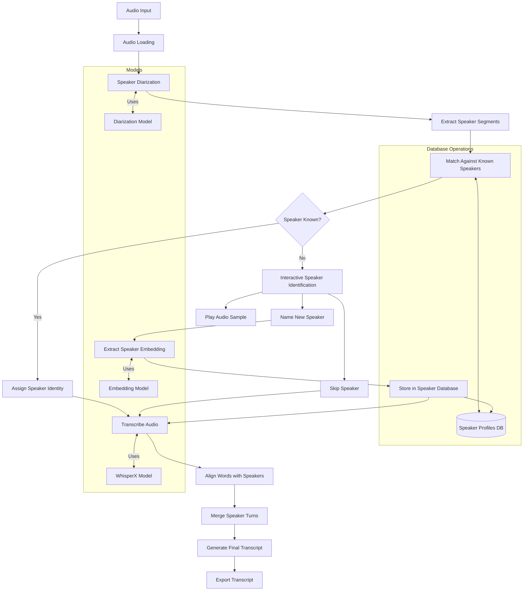

# System Workflow Diagram

```mermaid
flowchart TD
    A[Audio Input] --> B[Audio Loading]
    B --> C[Speaker Diarization]
    C --> D[Extract Speaker Segments]
    
    D --> E[Match Against Known Speakers]
    
    E --> F{Speaker Known?}
    F -->|Yes| G[Assign Speaker Identity]
    F -->|No| H[Interactive Speaker Identification]
    
    H --> I[Play Audio Sample]
    H --> J[Name New Speaker]
    H --> K[Skip Speaker]
    
    J --> L[Extract Speaker Embedding]
    L --> M[Store in Speaker Database]
    
    G --> N[Transcribe Audio]
    M --> N
    K --> N
    
    N --> O[Align Words with Speakers]
    O --> P[Merge Speaker Turns]
    P --> Q[Generate Final Transcript]
    
    subgraph Database Operations
        DB[(Speaker Profiles DB)]
        E <--> DB
        M --> DB
    end
    
    subgraph Models
        model1[Diarization Model]
        model2[Embedding Model]
        model3[WhisperX Model]
        
        C <-- Uses --> model1
        L <-- Uses --> model2
        N <-- Uses --> model3
    end
    
    Q --> R[Export Transcript]
```